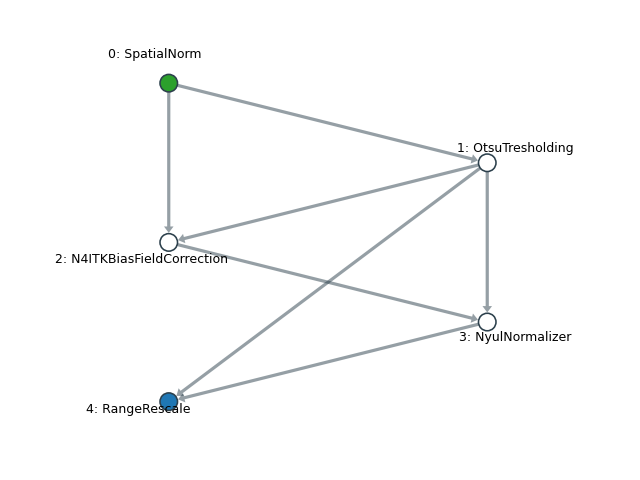
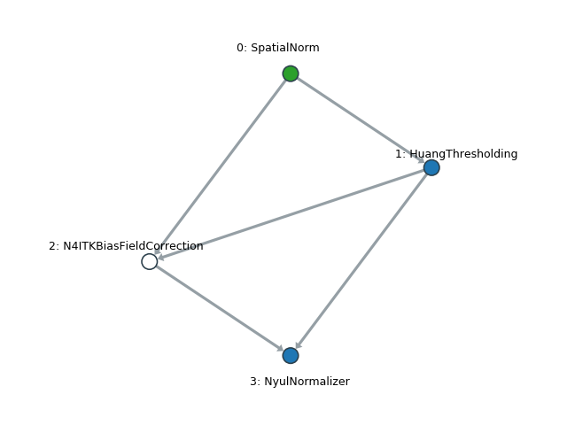

# Introduction

Radiomics is the high-throughput data mining of imaging features to identify potential markers that are relevant to a
pathology or an interesting trait. It has the potential to enable personalized treatment design and disease management.
To be able to characterize a lesion in a non-invasive fashion is its major value. However, the clical community is expressing concerns with regard to the reproducibility of radiomics results.

Reproducibility is unfortunately a complicated issue for radiomics because it invovles multiple steps and each step
contributes some variations that could stack up along the pipeline and lead to unstable results. Its some what like
trying to walk straight blind-folded such that the error you make each stack accumulates and you will probably find
yourself way off when you take the cloth off.

One of the most important source of this variation comes from image acquisition, particularly weighted MRI. Majority of
the clinically evaluated MRI sequences are not quantitative such that the pixel intensities are not tissue-specific,
including the commonly used T1- and T2-weigthed sequences. This means that the same patients scanned in different
machine, or even the same machine at different time, could give images with very different intensity profiles. As such, many normalization algorithms were proposed to enable quantitative studies using MRI.

Regardless, normalization algorithms are a crucial factors that affects the values of the radiomics features extracted.
In other words, same image normalized differently gives different radiomics features and does not yeild valid
comparison. With this regards, this code repo aims to provide a user-friendly and standardized way to normalize the
images

## Key Functions

This repo aims to maximize the repeatability of the image normalization pipeline, with a focus of MRI. Normalization
generally consist of the following steps:

1. Bias field correction
2. Align image spacing
3. Outlier removal
4. Intensity normalization
5. Binning

# Requirements

- SimpleITK >= 2.1.0
- networkx >= 2.5
- decorator >= 5.0.7
- cachetools >=4.2.2
- netgraph >= 0.7.0

# Install

Installation using pip

```bash
pip install git+https://github.com/alabamagan/mri_normalization_tools
```

# Examples

## General Example

> 
>
> Caption: Green node is the input node, blue node is the output node.

```python
from pathlib import Path
from mnts.filters.geom import *
from mnts.filters.intensity import *
from mnts.filters.mnts_filters_graph import MNTSFilterGraph
import matplotlib.pyplot as plt
import SimpleITK as sitk

from mnts.utils import repeat_zip
from mnts.filters import mpi_wrapper
from mnts.filters.intensity import NyulNormalizer

import pprint

# If this protector is absent, windows python might go into recursive import loop.
if __name__ == '__main__':
    # Create the normalization graph.
    G = MNTSFilterGraph()

    # Add filter nodes to the graph.
    G.add_node(SpatialNorm(out_spacing=[1, 1, 0]))
    G.add_node(OtsuThresholding(), 0)  # Use mask to better match teh histograms
    G.add_node(N4ITKBiasFieldCorrection(), [0, 1])
    G.add_node(NyulNormalizer(), [2, 1])
    G.add_node(RangeRescale(0, 5000), 3, is_exit=True)
    G.add_node(SignalIntensityRebinning(num_of_bins=256), 3, is_exist=True)

    # Plot the graph
    G.plot_graph()
    plt.show()

    # Borrow the trained features, please run example 04 if this reports error.
    state_path = Path(r'./example_data/output/.EG_04_temp/EG_04_States/2_NyulNormalizer.npz')
    G.load_node_states(3, state_path)  # 3 for NyulNormalizer node index

    # Write output images
    image_folder = Path(r'./example_data')
    images = [f for f in image_folder.iterdir() if f.name.find('nii') != -1]
    output_save_dir = Path(r'./example_data/output/EG_05')
    output_save_dir.mkdir(parents=True, exist_ok=True)
    for im in images:
        save_im = G.execute(im)
        fname = output_save_dir.joinpath(im.name).resolve().__str__()
        print(f"Saving to {fname}")
        sitk.WriteImage(save_im[4], fname)  # RangeRescale output at node index 3
```

## Creating graph from yaml file

### Example YAML file



```yaml
SpatialNorm: # This layer should have the same name as the filter name
    out_spacing: [0.5, 0.5, 0] # All kwargs arguments can be specified in this format

HuangThresholding:
    closing_kernel_size: 10
    _ext: # The argument of the method MNTSFilterGraph.add_node(), must be specified with _ext key
        upstream: 0 # Keyword upstream is also necessary, otherwise, the node will be see as an input node.
        is_exit: True

N4ITKBiasFieldCorrection:
    _ext:
        upstream: [0, 1]
  
NyulNormalizer:
    _ext:
        upstream: [2, 1]
        is_exit: True
```

### Python script

```python
from pathlib import Path
from mnts.filters.mnts_filters_graph import MNTSFilterGraph

yaml_file = '_test_graph.yaml'

if __name__ == '__main__':
    G = MNTSFilterGraph.CreateGraphFromYAML('_test_graph.yaml')
    print(G)
    Path('default.log').unlink() # Remove useless log file
```

# TODO

- [X] Training required filters
- [X] Intensity normalization ignores segmentation (UInt8 image won't be processed, might need `force` option?)
- [ ] Image registration
- [X] Graph label the filter names
- [X] Overflow protection for some function
- [X] MRI bias field correction
- [ ] Support processing labels together with images (for spatial operations only)
- [ ] Finish pipeline implementation
- [x] MPI examples
- [ ] Better documents for usage of dicom2nii

# Example Data

The example data was obtained through the openneuro initiative, accessed [here](https://openneuro.org/datasets/ds000105/versions/00001) [1-3]. The data was not matched with any diagnosis or pathology here. A subset of T1-weighted images were extracted from the original public domain data, which were renamed into the followings:

```
.
└── examples/
    └── example_data/
        ├── MRI_01.nii.gz
        ├── MRI_02.nii.gz
        └── MRI_03.nii.gz
```


## Reference

[1] Haxby, J.V., Gobbini, M.I., Furey, M.L., Ishai, A., Schouten, J.L.,Pietrini, P. (2001). Distributed and overlapping representations of faces and objects in ventral temporal cortex. Science, 293(5539):2425-30

[2] Hanson, S.J., Matsuka, T., Haxby, J.V. (2004). Combinatorial codes in ventral temporal lobe for object recognition:  Haxby (2001) revisited: is there a "face" area? Neuroimage. 23(1):156-66 O'Toole, A.J., Jiang, F.,

[3] Abdi, H., Haxby, J.V. (2005). Partially distributed representations of objects and faces in ventral temporal cortex. J Cogn Neurosci, 17(4):580-90

## License of usage


This dataset is made available under the Public Domain Dedication and License v1.0, whose full text can be found at [http://www.opendatacommons.org/licenses/pddl/1.0/](http://www.opendatacommons.org/licenses/pddl/1.0/). We hope that all users will follow the ODC Attribution/Share-Alike Community Norms ([http://www.opendatacommons.org/norms/odc-by-sa/](http://www.opendatacommons.org/norms/odc-by-sa/)); in particular, while not legally required, we hope that all users of the data will acknowledge the OpenfMRI project and NSF Grant OCI-1131441 (R. Poldrack, PI) in any publications.
